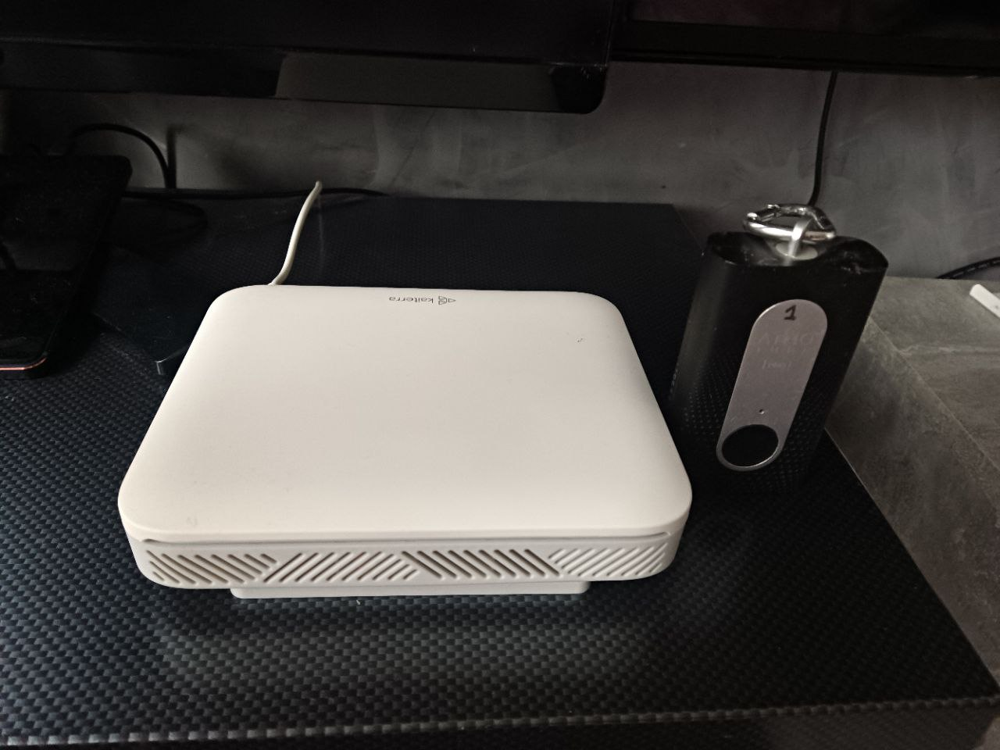

# Multi-Mining and IoT Setup

## Overview
This repository documents my multi-mining setup using LoRaWAN gateways and IoT sensors to mine tokens across multiple blockchain networks: Helium (HNT), Crankk (CRKK), Ambient Network (Solana), and Piphi Network (Algorand). The project combines blockchain technology, IoT, and DevOps skills to optimize decentralized networks.

## Hardware
- **LoRaWAN Gateways**: SenseCAP M1 (4GB), Finestra, Browan MerryIoT, Bobcat 300 (EU868 frequency).
- **Sensors**: PM/CO2 air quality sensors.
- **Additional Tools**: Software-Defined Radio (SDR) for Piphi Network integration.
- **Setup Photo**:  
  

## Software
- **Operating System**: Crankk OS (customized for multi-mining).
- **Tools**: Docker, Linux (Ubuntu/Debian), Bash scripting.
- **Protocols**: LoRaWAN, MQTT, SDR configurations.
- **Crankk Servers**: Configured with `csap.crankk.io` (ChirpStack) and `mqtt.crankk.org` (MQTT).

## Files
- **`Dockerfile.xardian`**: Dockerfile for running Xardian CLI (XProtocol) on ARM64 devices. Requires `runner.linux.arm64` from [Xardian releases](https://github.com/xprotocol-org/xardian/releases).
- **`global_conf.json`**: Sample Packet Forwarder configuration for Crankk OS, tailored for EU868 with Crankk servers (`csap.crankk.io` and `mqtt.crankk.org`).

## Achievements
- Successfully mined HNT and CRKK simultaneously by re-flashing gateways with Crankk OS.
- Integrated air quality sensors into Ambient Network (Solana) for environmental monitoring.
- Connected gateways to Piphi Network (Algorand) via SDR for additional multi-mining revenue.
- Identified and reported a critical token distribution bug in Piphi Network, collaborating with developers to fix it.

## Future Plans
- Add Python scripts for monitoring mining performance.
- Experiment with more DePIN projects (e.g., Xardian/XProtocol) using Docker.
- Explore Web3 development for a personal blockchain project.

## Contact
Feel free to reach out: [badrudinomago@gmail.com](mailto:badrudinomago@gmail.com)
